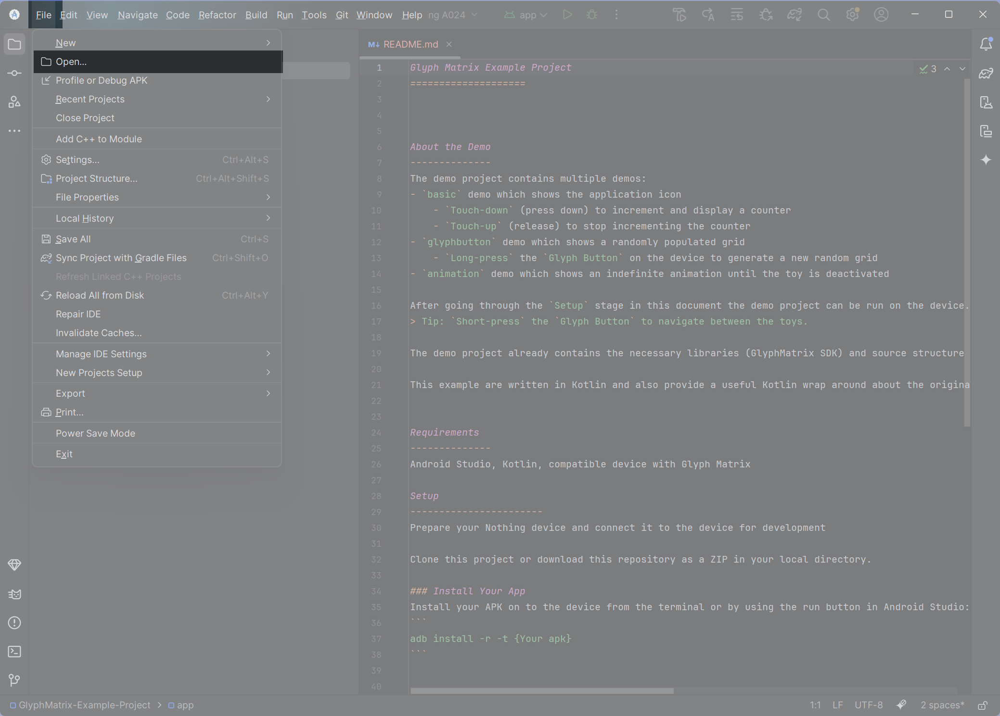
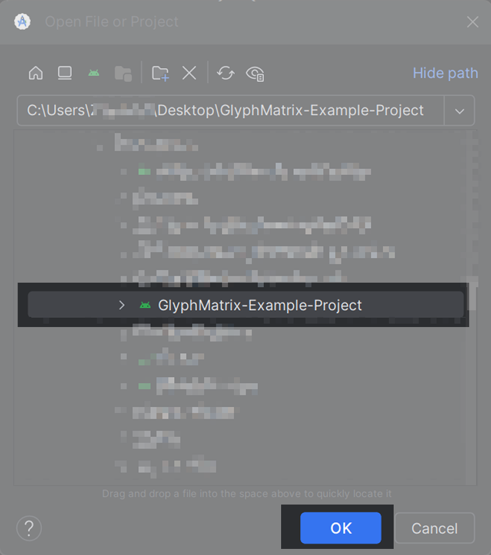
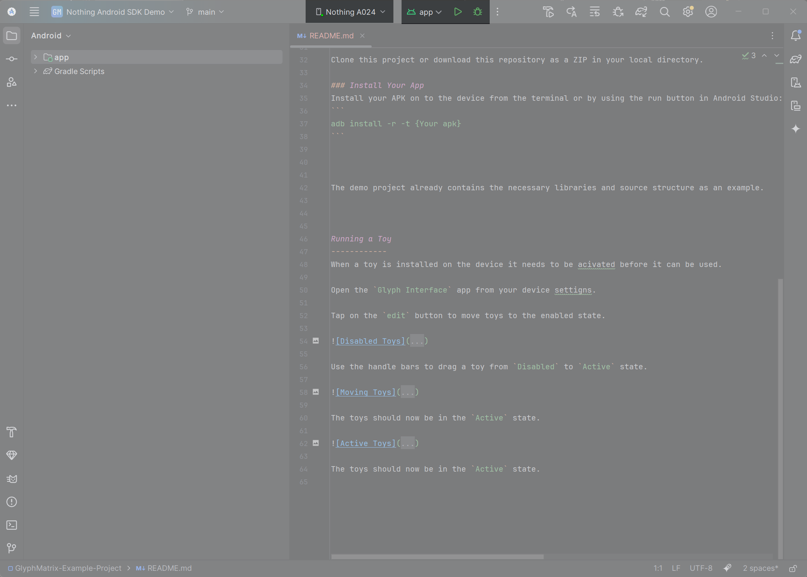
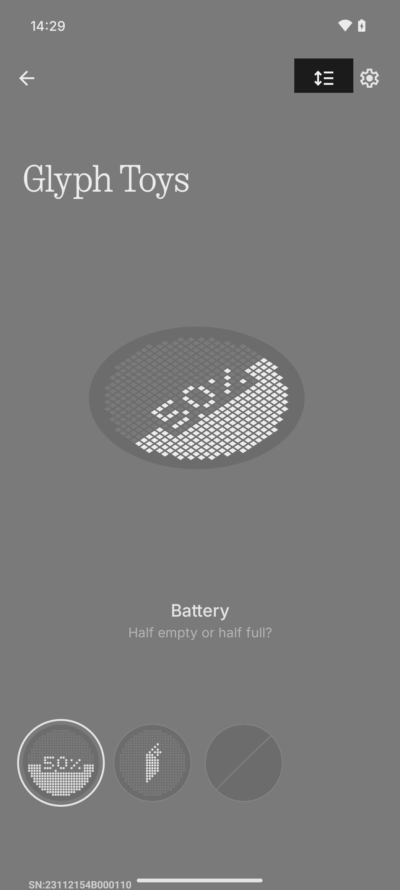
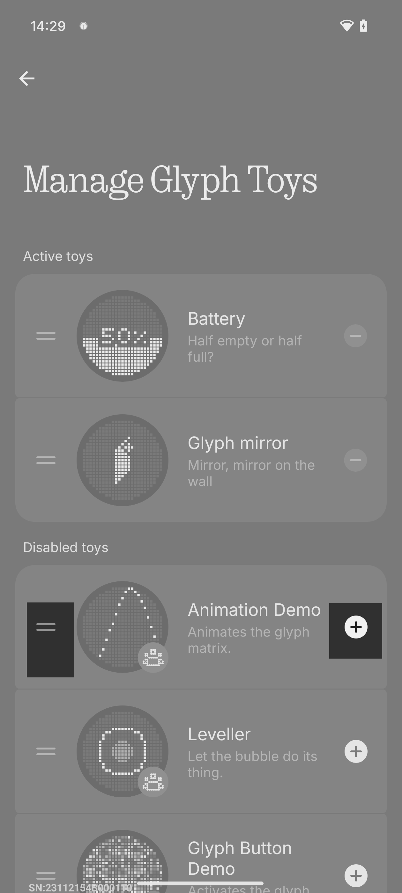
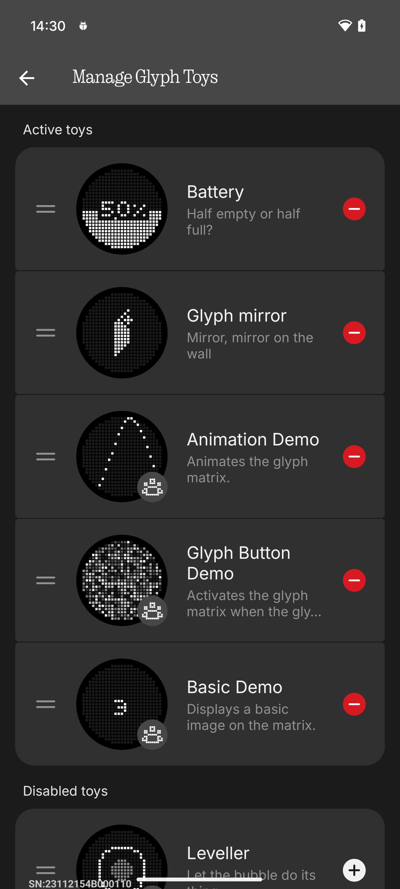

Glyph Matrix Example Project
====================

About the Demo
--------------
This example project contains multiple toy demos:
- `basic` demo which shows the application icon
    - `Touch-down` (press down) to increment and display a counter
    - `Touch-up` (release) to stop incrementing the counter
- `glyphbutton` demo which shows a randomly populated grid
    - `Long-press` the `Glyph Button` on the device to generate a new random grid
- `animation` demo which shows an indefinite animation until the toy is deactivated

After going through the `Setup` stage in this document the demo project can be run on the device.
> Tip: `Short-press` the `Glyph Button` to navigate between the toys.

The demo project already contains the necessary libraries (GlyphMatrix SDK) and source structure as an example. However, if you want to install libraries for your own application, please reference the [**SDK documentation**](https://github.com/KenFeng04/GlyphMatrix-Development-Kit).

This demo is written in Kotlin, it also utilize  a useful Kotlin wrapper `GlyphMatrixService.kt`，wrap around the original SDK that you can use in your own project.

https://github.com/user-attachments/assets/4dbaf7d1-fed0-4a1e-a0eb-38d9cbde046e

Requirements
--------------
Android Studio, Kotlin, compatible device with Glyph Matrix

Setup
-----------------------
**1.** Prepare your Nothing device and connect it to the computer for development

**2.** Clone this project or download this repository as a ZIP and uncompress it to your local directory.

**3.** Open a new windows in Android studio and hit file on the menu bar, select open.

**4.** Select the directory where you have cloned the repository or the unzipped folder and click `Open`

**5.** Once the Gradle files have been synced and your phone is connected properly, you should see your device name shown at the top and a play button. Click the play button to install this example project.

Running a Toy
------------
When the example project is installed on the device, toys within the project needs to be acivated before it can be used.

<table>
<tr>
<td width="60%" valign="top">

**1.** Open the `Glyph Interface` from your device settigns.

**2.** Tap on the first button on the right menu to move toys to the enabled state.

</td>
<td width="40%" align="center">

</td>
</tr>

<tr>
<td width="60%" valign="top">

**3.** Use the handle bars to drag a toy from `Disabled` to `Active` state.

</td>
<td width="40%" align="center">

</td>
</tr>

<tr>
<td width="60%" valign="top">

**4.** The toys should now be in the `Active` state, and can be viewed on the Glyph Matrix using Glyph Touch.

</td>
<td width="40%" align="center">

</td>
</tr>
</table>

